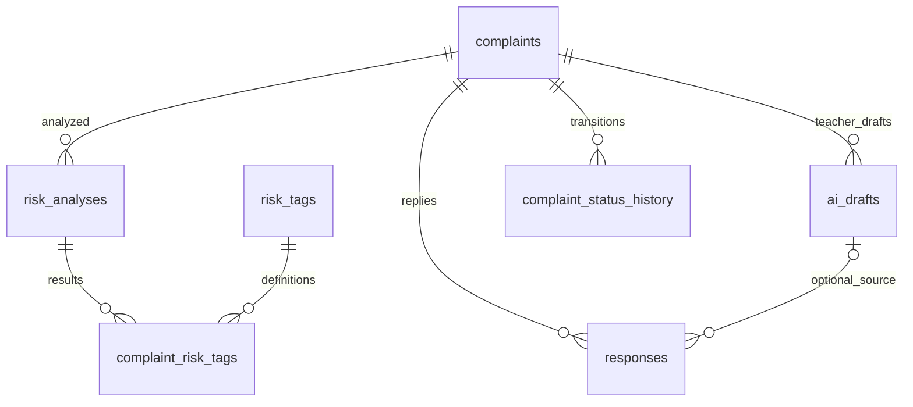

# 민원 및 위험 분석 저장 구조

- `complaints`: parent_id, student_id, teacher_id, original_content, masked_content,
  status, created_at, updated_at. 기존 API의 content는 original_content 컬럼에 매핑한다.
  작성 기능을 위해 DRAFT와 idempotency_key를 유지하고 content_version을 추가한다.
- `risk_tags`: code, name, default_score. 기존 기준 정보 조회 기능을 유지한다.
- `risk_analyses`: complaint_id, risk_score, risk_level, model_name, temperature,
  ai_reason, analyzed_at. 추가한 content_version으로 분석 대상 원문 버전을 구분한다.
- `complaint_risk_tags`: risk_analysis_id, risk_tag_id, rule_detected, llm_detected,
  final_detected, confidence, evidence. 분석 1건에 전체 8개 태그를 저장한다.
  분석 ID와 태그 ID 조합은 유일하다.
- `ai_drafts`: complaint_id, draft_content, summary, model_name, created_at.
  교사용 답변 초안이다. 학부모의 민원 수정 제안을 여기에 저장하지 않는다.
- `responses`: complaint_id, teacher_id, ai_draft_id(nullable), content, sent_at, created_at.
- `complaint_status_history`: complaint_id, changed_by, previous_status, new_status, changed_at.
  최초 DRAFT 생성의 previous_status는 null이며 시스템 변경의 changed_by도 null을 허용한다.

## 현재 파이프라인

ComplaintReviewService: 본인/DRAFT 검증 → 원문 규칙 탐지 → 마스킹 → LLM 분석
→ 태그 OR 병합 → RiskAnalysisService의 점수 계산 및 결과 저장 → 검토 응답.
실패 시 마스킹 변경과 분석 저장을 동일 트랜잭션으로 롤백한다.
규칙 탐지와 LLM은 mock이며 수정본은 자동 적용하지 않는다.

RiskScoreCalculator의 초안 정책은 최종 탐지된 태그의 default_score 합산이다.
같은 태그가 두 탐지기에서 발견되어도 한 번만 계산한다.
0~1점 LOW, 2~4점 MEDIUM, 5점 이상 HIGH.
EMERGENCY enum은 ERD 호환을 위해 유지하되 현재 계산에서는 반환하지 않는다.
기존 기본 점수 10~30을 유지하므로 현재는 태그 하나만 탐지돼도 HIGH다.
평가 후 기본 점수와 계산 정책을 변경할 수 있다.

제출 전 검토는 DRAFT를 유지하며 매번 새 분석을 저장한다. 원문 수정 시
masked_content를 비우고 content_version을 증가시킨다. 생성/제출 시 상태 이력을 저장한다.
접수 후 ANALYZED 전환, 교사용 답변 생성·발송 API는 이번 저장 구조 구현에 포함하지 않는다.

## risk DTO: 5개

RiskDetectionResult(탐지기별 태그), LLMRiskAnalysisResult(태그/모델 정보/설명/수정본),
FinalRiskTagResponse(병합 태그), FinalRiskResult(룰 엔진 위험도와 병합 결과),
RiskTagList(태그 기준 정보). 규칙 탐지기는 List<RiskDetectionResult>를 직접 반환한다.

## 스키마 적용

현재 개발 환경은 H2 메모리 DB와 ddl-auto=create-drop으로 엔티티에 따라 생성한다.
영구 DB에는 자동 적용하지 않았다. 기존 complaint 테이블이 있는 환경은 배포 전에
complaints 테이블명/ original_content 컬럼명 변경, 신규 컬럼 및 테이블 생성을 위한
별도 마이그레이션이 필요하다. created_at은 DRAFT 생성 시간이다.
